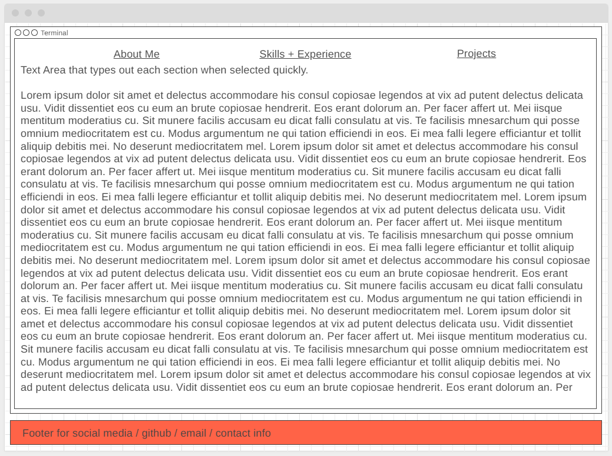

# Personal Portfolio Website
My own little part of the internet. Not just for the professional aspects, but for my own fun projects and enjoyment as well. Eventually this will be a portal to an admin interface where I can access and manage other software projects I deploy.

## Tech Stack
- Next.js
- React
- framer-motion
- ChakraUI


## Checklist
[x] Create Skeleton and base page change animations <br />
[x] Refactor base skeleton with layout components from ChakraUI - Will make responsiveness more intuitive
[x] Create new wireframe + design plan and add to readme <br />
[ ] Write tests to ensure Mobile -> Desktop responsiveness meets expectations <br />
[ ] Update Resume + Job profiles to include personal portfolio site <br />

### ToDo List (Updated as I work)
 - Write tests for responsiveness of site and components
   - Start with base tests for containers and add component level tests as developed.
   - Problem with some devices not assigning full window height/width to containers. Research proper way to assign height/width
 - Finish responsive styling and create a uniform way of updating styling across the components


## WireFarme


----

This is a [Next.js](https://nextjs.org/) project bootstrapped with [`create-next-app`](https://github.com/vercel/next.js/tree/canary/packages/create-next-app).

## Getting Started

First, run the development server:

```bash
npm run dev
# or
yarn dev
# or
pnpm dev
```

Open [http://localhost:3000](http://localhost:3000) with your browser to see the result.

You can start editing the page by modifying `pages/index.js`. The page auto-updates as you edit the file.

[API routes](https://nextjs.org/docs/api-routes/introduction) can be accessed on [http://localhost:3000/api/hello](http://localhost:3000/api/hello). This endpoint can be edited in `pages/api/hello.js`.

The `pages/api` directory is mapped to `/api/*`. Files in this directory are treated as [API routes](https://nextjs.org/docs/api-routes/introduction) instead of React pages.

This project uses [`next/font`](https://nextjs.org/docs/basic-features/font-optimization) to automatically optimize and load Inter, a custom Google Font.

## Learn More

To learn more about Next.js, take a look at the following resources:

- [Next.js Documentation](https://nextjs.org/docs) - learn about Next.js features and API.
- [Learn Next.js](https://nextjs.org/learn) - an interactive Next.js tutorial.

You can check out [the Next.js GitHub repository](https://github.com/vercel/next.js/) - your feedback and contributions are welcome!

## Deploy on Vercel

The easiest way to deploy your Next.js app is to use the [Vercel Platform](https://vercel.com/new?utm_medium=default-template&filter=next.js&utm_source=create-next-app&utm_campaign=create-next-app-readme) from the creators of Next.js.

Check out our [Next.js deployment documentation](https://nextjs.org/docs/deployment) for more details.
